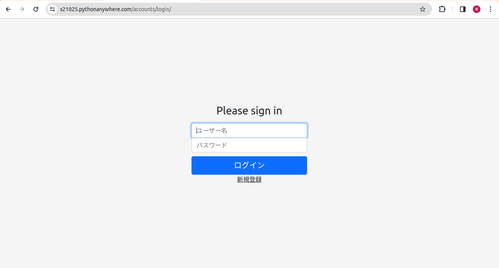
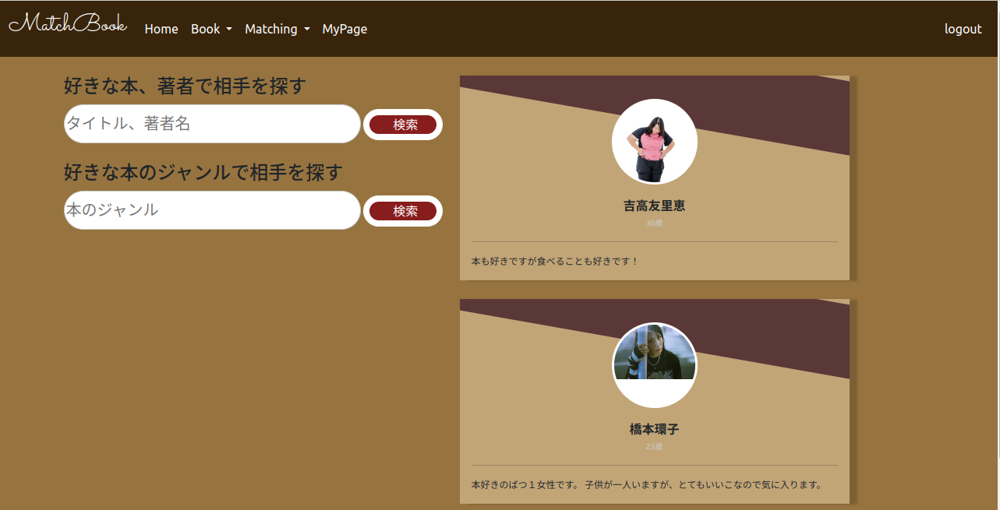
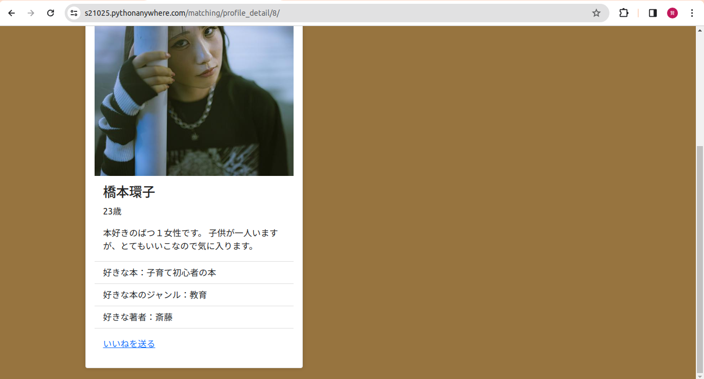
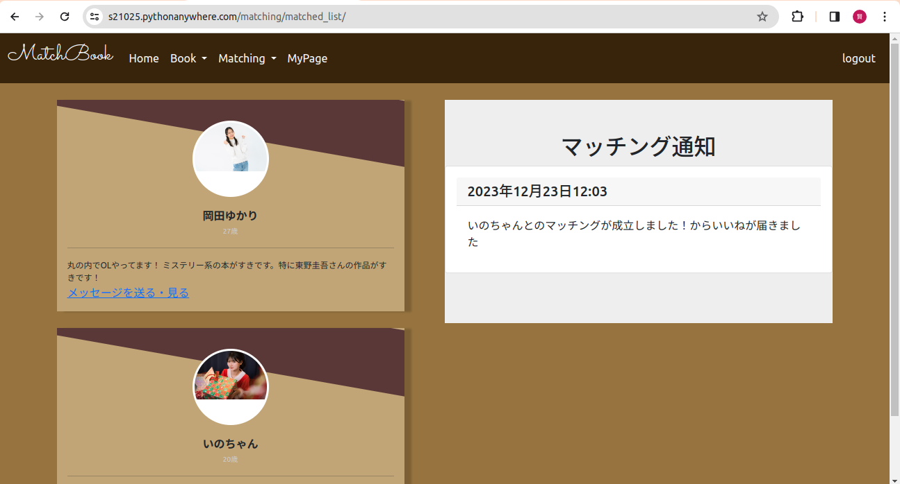
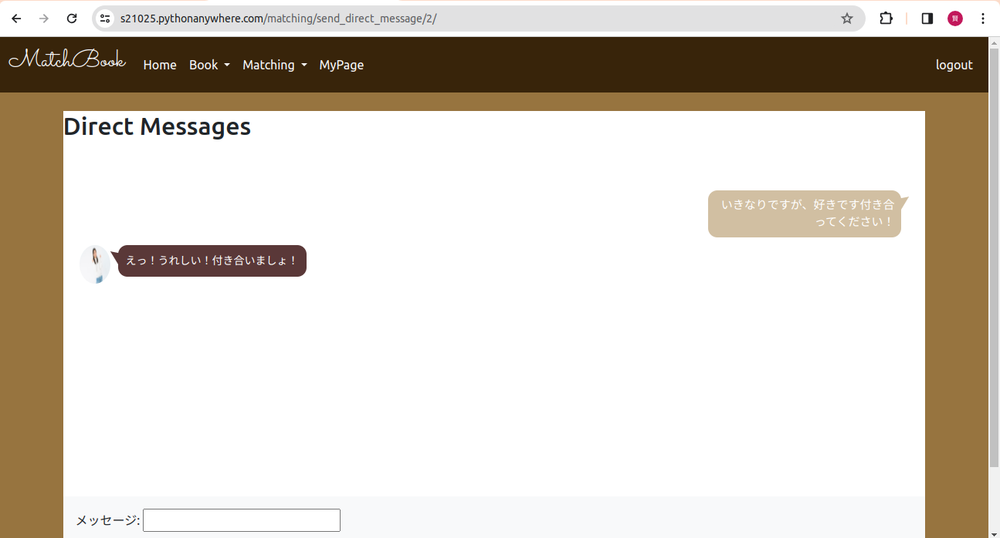
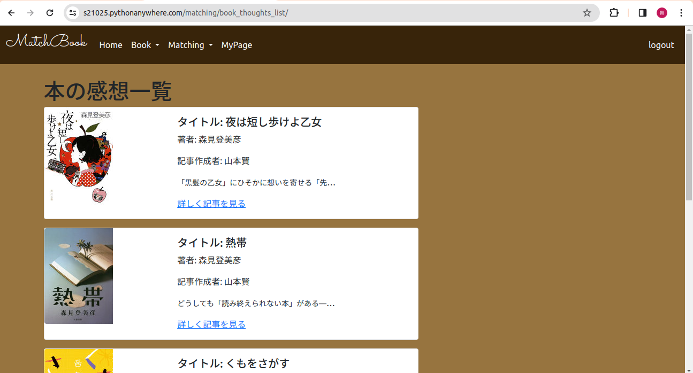
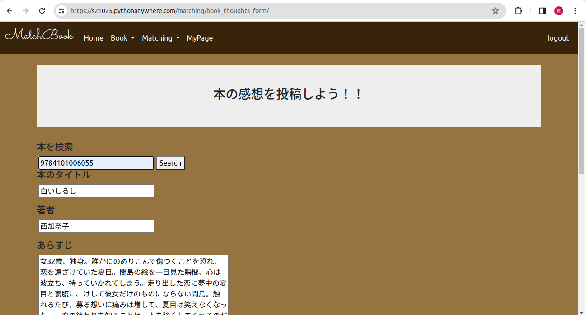

#  卒業研究　成果物  
##  サイト名：　MatchBook  
#  1, 概要説明
こちらのサイトは、読書好きの異性と気軽にマッチングできるサイトとなっております。　　
#  2, 機能  
## 2-1, 異性とのマッチング機能  
こちらの機能は、お互いにいいねを送り合うことでマッチングが成立し、  
成立したユーザー同士でダイレクトメッセージのやり取りができるようになります。
## 2-2, 本の感想投稿機能  
こちらの機能は、ユーザーが読んだ本の感想を投稿することができる機能になります。  
本のisbn番号を入力していただくと本のタイトル、著者、あらすじが自動で入力されます。  
本の感想をユーザーに登録してもらうことで、マッチングする際の判断材料が増えます。  
#  3, 使い方  
## 3-1, 新規登録・ログインをする
  
サイトに移動してもらうと、ログイン画面が出てきます。  
ユーザー登録をしていない方は、新規登録ボタンを押してユーザー登録を行ってください。    
新規登録した後は、ログイン後にプロフィール登録画面でプロフィールを登録してもらいます。  
すでに、ユーザー登録・プロフィール登録をしている場合はログイン後、トップページに移動します。  

## 3-2, 気になる相手を見つける

トップ画面に異性のプロフィール一覧がでてきます。  
こちらの画面で気になる異性がいれば、顔写真のアイコンをクリックしていただくと,プロフィールの詳細を見ることができます。

## 3-3, プロフィールを見てマッチングしたい場合はいいねを相手に送る

相手のプロフィールを見ていいなと感じれば、いいねボタンを押して相手にいいねを送ることができます。  
いいねを送ると相手に通知がいき、相手側からいいねを送られると、マッチングが成立します。  

## 3-4, お互いにいいねを送りあった場合、マッチングが成立

マッチングが成立すると、マッチング済み画面に相手のプロフィールが表示されます。  

## 3-5, マッチングが成立すれば、ダイレクトメッセージを送ることができる

マッチングが成立したのと同時に相手にダイレクトメッセージを送ることができます。  
メッセージを送って、もっと相手のことを知ることができます。  
また、仲がより深まったタイミングでデートに誘ってもいいでしょう。  

## 3-6, ユーザーの本の感想を見て、気になる相手を見つける

ユーザーのプロフィールだけでマッチングの判断ができない場合は、ユーザーの本の感想を見て  
マッチングする際の参考にすることができます。  
こちらはナビバーのbookの中にある本の感想一覧を押すとページが移動します。  
気になる投稿があれば、詳細をみるを押していただくことで、詳しく感想を詳しく見れます。  

## 3-7, 自分が読んだ本の感想を投稿して、相手のマッチング判断材料を増やす

また、自分が本の感想を投稿したい場合は、ナビバーのbookの中にある本の感想を投稿ボタンから投稿できます。  
本のisbn番号を入力していただくと、本のタイトル、著者、あらすじが自動で入力されます。  
あとは、自分が思った感想を書いて投稿ボタンを押すと、投稿完了です。  

#  4, 使用環境  
このマッチングサイトはWebアプリケーションなので、ブラウザが使用できる環境であれば使えます。  
※現在はサーバーを閉じさせて頂いている状態なので使用することができません。
#  5, 制作者  
## ITカレッジ沖縄 スペシャリスト科 山本賢 長嶺星翔  

#  6, 今後の計画  
今後このWebアプリの追加機能の実装はございません。  
また、バグやエラーなどの対処も行ないません。  
これからは、会社で必要な技術を磨いていこうと思っている所存でございます。  

